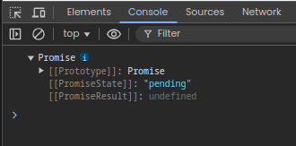
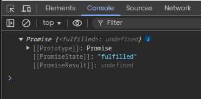
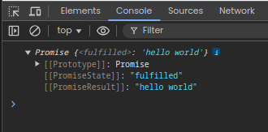
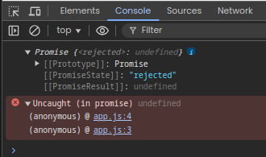

# Promise

### pending:
``` js
const promise = new Promise((resolve, reject) => { // can call them whatever we want , but given is the standard

})
console.log(promise);
```

Output:



### fulfilled:

``` js

const promise = new Promise((resolve, reject) => { // can call them whatever we want , but given is the standard
    resolve()
})
console.log(promise);
```

   

``` js
const promise = new Promise((resolve, reject) => { // can call them whatever we want , but given is the standard
    resolve("hello world")
})
console.log(promise);
```



### Rejected: 

``` js
const promise = new Promise((resolve, reject) => { // can call them whatever we want , but given is the standard
    reject()
})
console.log(promise);
```




